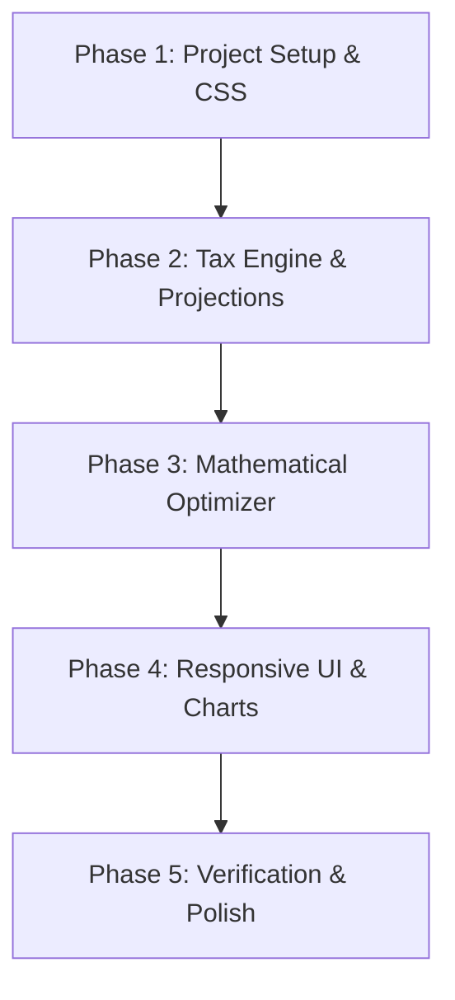

# Implementation Plan - Roth Conversion Optimizer Web App

This document outlines the architecture, file structure, algorithms, and development phases for building the Roth Conversion Optimizer as a responsive, client-side static web application.

---

## 1. Proposed Architecture & Tech Stack

To ensure instant calculations, maximum security, and easy hosting on GitHub Pages, we propose a lightweight, zero-dependency static web application:

*   **Core Structure:** Standard HTML5 and modular JavaScript (ES6 Modules) to run natively in any browser without needing a complex Node/npm build chain.
*   **Styling:** Custom Vanilla CSS for rich glassmorphism dark-mode aesthetics, responsive grids, and clean input controls.
*   **Visualizations:** [Chart.js](https://www.chartjs.org/) via CDN to render the high-density line chart and stacked bar chart smoothly with interactive hover states.

### File Structure
```text
Roth/
├── index.html            # Main entry point (Dashboard HTML layout)
├── style.css             # Vanilla CSS design system (Dark mode & layout)
├── requirements.md       # Finalized specification
├── ux_proposal.md        # Approved UX proposal
├── dashboard_ui_mockup.png # High-fidelity UI mockup reference
└── src/
    ├── main.js           # App initialization and DOM controller
    ├── taxEngine.js      # Tax calculations (Fed/State brackets, RMDs, SS)
    ├── optimizer.js      # Mathematical optimizer (Option B search algorithm)
    └── chartManager.js   # Chart.js initialization and updates
```

---

## 2. Core Modules & Engine Specifications

### A. Tax Engine (`src/taxEngine.js`)
*   **Inflation Rules:** Adjusts tax brackets, standard deductions, pension, and Social Security streams annually by a configurable inflation rate (default: 2.5%).
*   **SS provisional income:**
    $$\text{Provisional Income} = \text{AGI (excluding SS)} + \text{Tax-Exempt Interest} + 0.5 \times \text{Social Security Benefit}$$
    *   Calculates the portion of SS subject to ordinary income tax (0%, 50%, or 85%) using standard IRS brackets.
*   **RMD Calculation:** Determines RMD for Traditional IRA based on the IRS Uniform Lifetime Table (SECURE Act 2.0 RMD age of 75 for born 1960+).
*   **State Taxes:** Flat state tax fallback rates or bracket lookups based on selected state.

### B. Mathematical Optimizer (`src/optimizer.js`)
*   **Optimization Target:** Maximize **After-Tax Adjusted Net Worth** at target age:
    $$\text{Target} = (\text{IRA} \times (1 - \text{Discount Rate})) + \text{Roth} + \text{Brokerage}$$
*   **Algorithm:**
    *   A grid-search / coordinate descent optimization that iterates over the conversion years (between retirement and RMD age, or start date to life expectancy) to find the conversion schedule that maximizes the target metric.
    *   Ensures conversion taxes are paid from the Brokerage account first.

---

## 3. Phased Execution Plan



### Phase 1: Project Setup & Styling
*   Create `index.html` structure with semantic panels.
*   Implement `style.css` containing dark-mode theme, glassmorphic layout, and responsive flexbox/grid.
*   Configure Chart.js integration.

### Phase 2: Tax Engine & Projections
*   Write `taxEngine.js` containing tax bracket datasets and year-by-year calculation loops.
*   Validate projection loops for the "Without Conversion" baseline (RMDs, taxes, and asset growth over time).

### Phase 3: Mathematical Optimizer
*   Write `optimizer.js` containing the search algorithm.
*   Connect the optimizer to run against the projection loop, returning the annual conversion schedule.

### Phase 4: UI Controls & Dynamic Charting
*   Implement the Left Sidebar inputs and link them to sliders.
*   Create the **Dual-Input Synchronization** script in `main.js`.
*   Connect inputs to live recalculation loops.
*   Implement `chartManager.js` to draw and animate the Net Worth line chart and Stacked Bar charts.

### Phase 5: Verification & Polish
*   Add inline warnings for Medicare IRMAA cliffs when conversions trigger higher tiers.
*   Double-check calculations against official tax worksheets.
*   Deploy to GitHub Pages.

---

## 4. Verification Plan

### Automated/Mathematical Verification
*   Write unit test assertions directly in the browser console logs during development to verify:
    *   SS Taxability calculations (matching standard IRS worksheets).
    *   RMD ages and factors.
    *   Inflation adjustments for bracket bounds.

### Manual Verification
*   Verify slider responsiveness and input field synchronization.
*   Check charts render cleanly on mobile and desktop screens.

---

## 5. Git Repository Integration
We will configure the local workspace to track your private repository:
*   **API Key Requirement:** No dedicated API key is required. We will execute git commands through your local command line, which automatically leverages your local system's existing git credentials (SSH keys or git credential helper) to push to your private `https://github.com/inblack/roth-optimizer` repository.
*   **Setup Steps:** We will initialize the repository locally, add your repository as the `origin` remote, commit the files, and prepare them for pushing.


>> Review notes https://github.com/inblack/roth-optimizer can be used on Github for the project files it is currently private do you need an api key?
