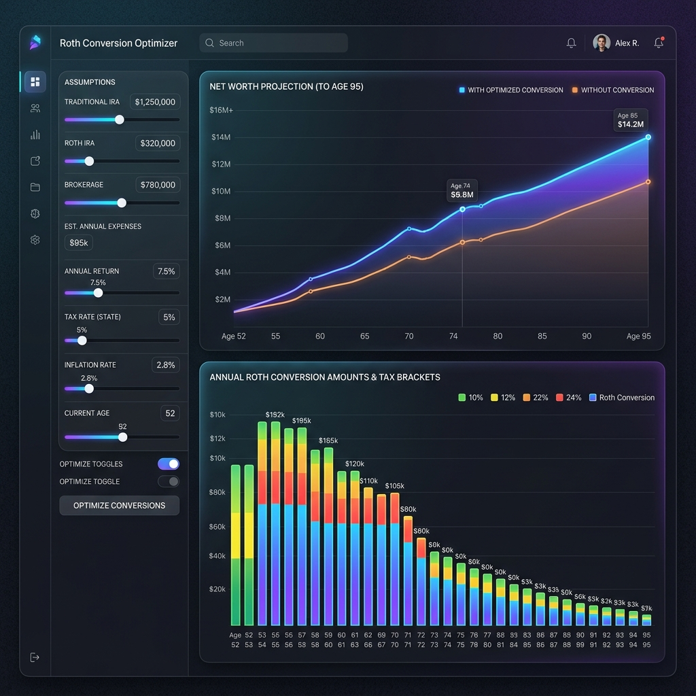

# UX Proposal: Roth Conversion Optimizer

This proposal outlines the user experience (UX) strategy, design pillars, page architecture, and user persona for the Roth Conversion Optimizer. The goal is to design a tool that matches the rigor of professional software like **Holistiplan** and **RightCapital**, but with the responsiveness and clarity of a modern client-side web application.

---

## 1. User Persona

### **David, 62 — Self-Directed Retiree / Analytical Planner**
*   **Background:** Retired early from a corporate career. Highly analytical and comfortable with spreadsheets, but frustrated by the limitations of static models.
*   **Goals:**
    *   Find the exact mathematical optimum for Roth conversions over his lifetime.
    *   Avoid triggering unnecessary tax penalties, especially Medicare IRMAA surcharges and the Social Security "tax torpedo" (provisional income taxation).
    *   Ensure his heirs are not hit with massive tax brackets due to the SECURE Act 10-year rule.
*   **Pain Points:**
    *   Generic retirement calculators do not account for state taxes, dynamic RMD factors, or multi-scenario optimization.
    *   Building a multi-year optimizer in Excel/Google Sheets requires complex iterative macros (circular references) that are slow and easily break.
    *   Most financial planning software is locked behind expensive professional advisory licenses.

---

## 2. Competitive UX Benchmarks & Professional Standards

Based on market leaders, a professional-grade planning tool must deliver on three core expectations:

1.  **Year-by-Year Tax Bracket Visualization (Holistiplan style):** Advisors and clients must see exactly how much conversion headroom remains in each marginal tax bracket (10%, 12%, 22%, 24%, etc.) before hitting the next tax tier or IRMAA cliff.
2.  **Interactive Side-by-Side Comparisons (RightCapital style):** The value of a Roth conversion must be visually demonstrated by showing a "No Conversion" baseline scenario next to the "Optimized Conversion" strategy.
3.  **Real-Time Calculations & Sliders (NewRetirement style):** The user should be able to move a slider (e.g., changing the asset growth rate or inflation rate) and instantly see the charts update without waiting for a server reload.

---

## 3. Core UX Design Pillars

*   **Pillar 1: Progressive Disclosure (Complexity Control)**
    *   *Approach:* The dashboard defaults to a high-level summary (e.g., "Total Lifetime Tax Savings: $142,000") and a clean net worth projection chart. More detailed data (like the annual tax breakdown, IRMAA thresholds, and RMD calculations) are disclosed progressively as tabs, tooltips, or expandable tables.
*   **Pillar 2: Instant Mathematical Feedback**
    *   *Approach:* Running a search optimizer in a traditional app usually takes seconds to reload. By building this as a client-side JavaScript engine, calculations and optimizations run in milliseconds. The charts update immediately when input sliders are adjusted.
*   **Pillar 3: Visual "Guardrails" & Cliffs**
    *   *Approach:* The UI should flag potential hazards. For example, if a conversion amount pushes the user into a higher IRMAA threshold for that year, the bar should change color or show a warning icon, indicating that they are triggering a Medicare surcharge.

---

## 4. UI Dashboard Architecture

The interface is structured as a single-page dashboard with three main zones:

1.  **Left Sidebar (Input & Assumption Controls):**
    *   **Dual-Input Synchronization:** Every assumption and balance slider is paired with an adjacent numeric input field. Adjusting the slider updates the field, and typing into the field updates the slider instantly. This allows for both quick adjustments and precise keyboard entry.
    *   Financial starting points: Traditional IRA, Roth IRA, and Brokerage balances.
    *   Growth rate assumptions: Asset returns, inflation rate, state tax selector, and the target **IRA Tax Discount Rate** slider.
    *   An "Optimize" toggle to run the search algorithm.
2.  **Top Right Panel (Main Projection Graph):**
    *   A high-density line chart showing the comparison of Net Worth over time (up to Age 95) with and without conversions.
3.  **Bottom Right Panel (Marginal Tax Bracket & Conversion Breakdown):**
    *   A stacked vertical bar chart showing the user's taxable income over time. Each bar represents a year, with colored bands indicating tax brackets (10%, 12%, 22%, etc.), and a distinct overlay showing the optimized Roth conversion amount filling up those brackets.

---

## 5. UI Mockup (High-Fidelity)

Here is a visual mockup of the proposed dashboard design, highlighting a premium dark mode layout with clear visual hierarchy, interactive controls, and visual tax bracket filling:

